  

[][x]

<!-- Descomente quando tiver site:
[][site]
-->

Engenheiro de Software Sênior no [PagBank](https://pagbank.com.br). Construí minha carreira principalmente em **front-end e desenvolvimento web** — JavaScript, Node e React — e tenho um interesse especial por **desenvolvimento de jogos**.

- 🎮 Explorando desenvolvimento de jogos no tempo livre
- 🌱 Sempre estudando ferramentas e boas práticas do ecossistema web
- ⚡ Curiosidade: tentei uma carreira em odontologia antes de me encontrar na programação

### Conecte-se comigo

&nbsp;&nbsp;

<!-- Descomente quando tiver Instagram:
&nbsp;&nbsp;

-->

### Linguagens e ferramentas

  
  
  
  
  
  
  
  
  
  

[x]: https://x.com/leeo__victor
[site]: https://seusite.com
